## Real-Time Path Tracing Reconstruction In DXR

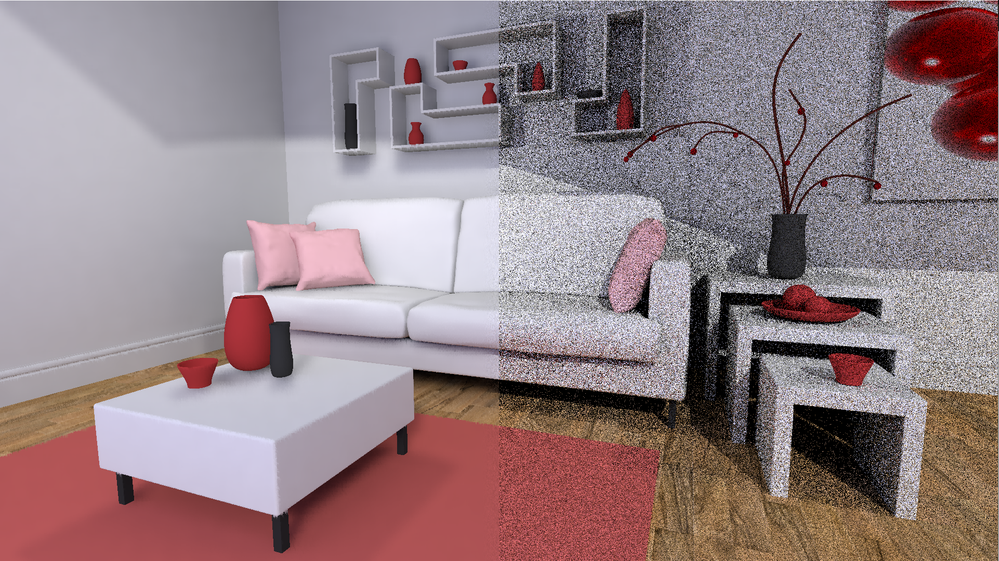

### Team member:

- Jiangping Xu
  - [LinkedIn](https://www.linkedin.com/in/jiangping-xu-365b19134)
- Gangzheng Tong
  - [LinkedIn](https://www.linkedin.com/in/gztong)
- Tianming Xu
  - [LinkedIn](https://www.linkedin.com/in/tianming-xu-8bb81816a)

### Project Goal

In the current game and film industry, **path tracing** is the best candidate for generating photorealistic and
physically correct pictures. However, the performance bottleneck has limited the usage of path tracing in
**real-time rendering** field. Given our interest in game industry, which concerns interactive/real-time
rendering, we want to explore the possibility of real-time path tracing using the denoising method
introduced recently in *SIGGRAPH 2019:* [*Blockwise Multi-Order Feature Regression for Real-Time
Path Tracing Reconstruction*](http://www.tut.fi/vga/publications/Blockwise_Multi-Order_Feature_Regression_for_Real-Time_Path_Tracing_Reconstruction.html) . We also know that the current **Direct3D 12** and **DirectX Ray Tracing(DXR)** are the latest API to render picture using ray-tracing technique. Hence, we want to build up a thorough pipeline in D12 to not only generate 1spp noisy input picture, but also denoise the input picture with feature buffer through the D12 computing shaders, and then generate the high quality processed-picture, recording the performance of that.

### How to Build and Run

**Note:** 

- Please use the following Windows SDK for building Folcor 3.1, otherwise you might encounter errors
  - [Microsoft Windows SDK version 1809 (10.0.17763.0)](https://developer.microsoft.com/en-us/windows/downloads/sdk-archive)

1. Clone this repository

2. Go into **Falcor** Folder and run [update_dependencies.bat](https://github.com/gztong/BMFR-DXR-Denoiser/blob/master/Falcor/update_dependencies.bat)
4. Open BMFR_Denoiser_Pipeline.sln
5. Build + Start in Release Mode

----------------------------------------------------------------------------------------------

### Overview:

    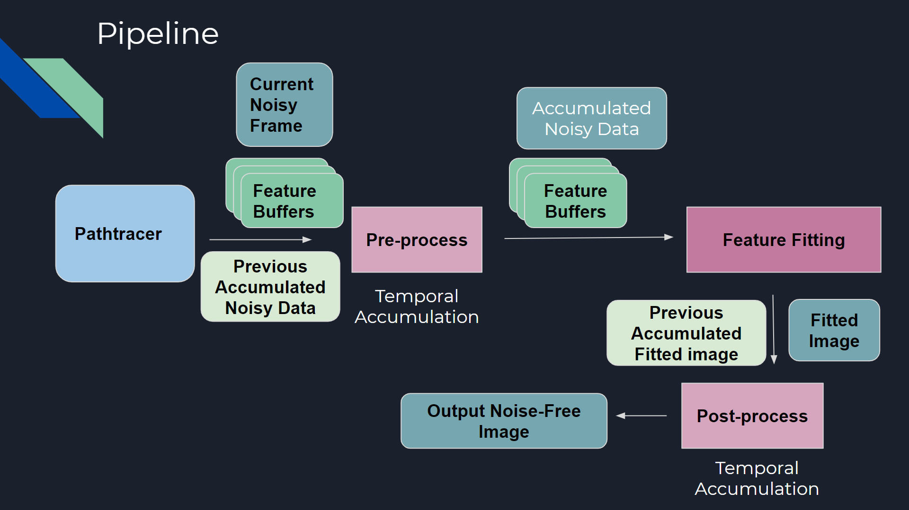

This project is a complete **DXR pipeline** that use 1 spp path tracing noisy image and *Blockwise Multi-Order Feature Regression* technique to produce high resolution physically-correct image. There are **four** stages in the pipeline:

1. A basic path tracer produces 1 spp output image and populates necessary feature buffers(normal and world position) based on the 1 spp image
2. Temporal accumulation of the noise image
3. Operate feature regression on non-overlapping image blocks
4. Temporal accumulation of the fitted image

We almost follow the original pipeline described in the BMFR paper, except for a modification when dealing with rank deficiency, which will be discussed later.

### Pipeline

#### Path Tracer and Feature Buffers

    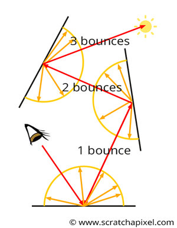

Path Tracing is a computer graphics Monte Carlo method of rendering images of three-dimensional scenes such that the global illumination is faithful to reality. Generally speaking, a path tracer shoots multiple rays from each pixel, which would interact with all the objects within the scene and based on the materials of each object, shoot subordinate rays from the intersection points. If the ray hits an emission surface(light source), the surface of the object it intersects with will be illuminated. The process is very similar to the one our eye proceeds the physical world, but in the opposite direction.

In our implementation, path tracer is the first stage we need to handle. Our path tracer will not only produce the 1 sample per pixel(spp) rendered image, but also will populate three feature buffers: WorldPosition, WorldNormal and DiffuseColor(albedo) of the objects. All of these data will be used in later stage.

Here, we need to thank NVIDIA for their [Falcor](https://developer.nvidia.com/falcor) library. Falcor is an open-source real-time rendering framework designed specifically for rapid prototyping. Besides, there is a great tutorial to teach us How to use Falcor: [*A Gentle Introduction To DirectX Raytracing*](http://cwyman.org/code/dxrTutors/dxr_tutors.md.html). Without their helps, we need to do everything from scratch and might not have enough time to build up the pipeline accordingly.

#### Pre-process (accumulate noisy data)

The core part of pre-process stage is the **temporal accumulation** of the noisy 1 spp data. We reproject current frame to the previous camera space, finding the corresponding pixels to accumulate with. World-space positions and normals are used to test whether the matching pixels correspond to the same location in the scene. If the tests pass, we compute a exponential moving average and mix 80% of the previous accumulated data with 20% of the current data. Following the modification made in BMFR, we also record the sample count for each pixel (stored in the alpha channel of color data) and compute a ragular moving average instead of the exponential moving average when the sample count is small (less than 5).

Here is a gif to show the live demo of turning on pre-process and not turn-on

#### Regression(BMFR)
In the regression step we fit the noisy data using the features generated from pathtracer. The main task of this step is trying to find a set of weights for each block that minimize the squared error between noisy input and regression result. The least-squares expression can be described as follow, 

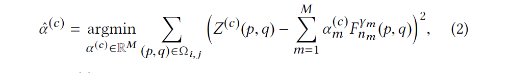

where alpha is the weights we are trying to find, Z is the noisy input, F_m^(gamma_m) is the m-th feature with an order of gamma_m, c denotes the channel (RGB) we are computing, p and q are the pixel coordinates in the current block omega_(i,j). 

Generally speaking, more features result to higher quality of filtered image,but will require more computation. Given the trade off between speed and quality, the following set of features are used in the pipeline,

 [1, normal_x, normal_y, normal_z, position_x, position_y, position_z, squared_position_x, squared_position_y, squared_position_z]

The [House-holder QR factorization](https://www.cs.cornell.edu/~bindel/class/cs6210-f09/lec18.pdf) is implemented in a compute shader to solve the least-squares problem. After that we calculate the weights by doing a back substitution over the R matrix we get from last step. Sometimes the R matrix is not full-ranked so we can't solve the problem with a unique answer. In the original BMFR paper, a small amount of noise is added to the features to deal with this issue. We also tried another method which gives a better performance in terms of both the speed and the image quality. We will discuss this in later section.

The fiited data may contains block-wise bias resulting from the variance of the input noisy image. The blocks are displaced with a given offset that changes over frames and then the regression results are acculumated in the next stage to remove the block-wise artifact.

Here is a gif to show the live demo of turning on regression(bmfr) and not turn on.

#### Post-Process

In this step we accumulate the fitted image with the history fitted result. We can reuse the matches and discards information calculated from pre-process. Currently we don't have the temporal anti-alias in pur pipeline.   

Here is a comparison between with and without post-process turning on.

    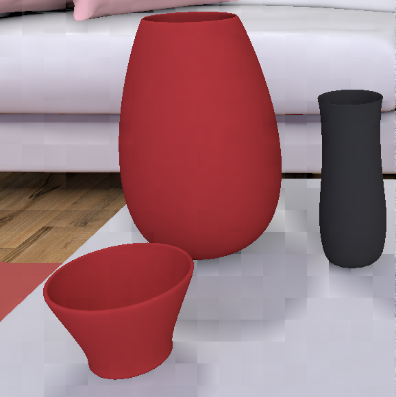
      ​Without post-process
     
     

    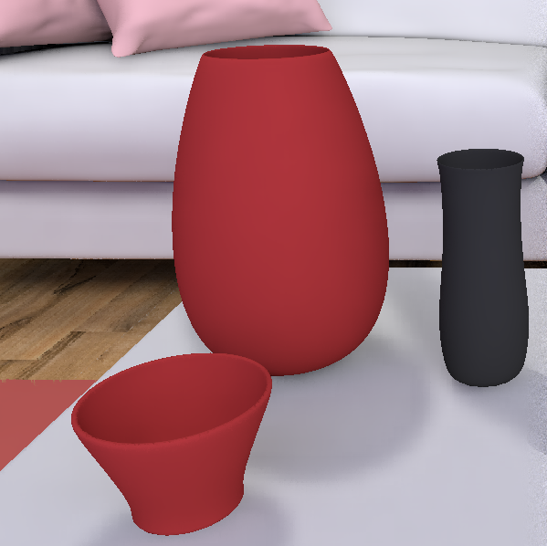
      With post-process
     
     

															     

You can clearly see the image with post-process doesn't have many blocky artifacts between the big red jar and black jar while the one without post-process has obvious blocky artifacts in that area.

### Modification

The reason why R matrix has rank deficiency is that sometimes the features we use are not linealy independent. For example, when a block of pixels shows the surface of a table, the y coordinates is the same accross the entire block, but we already have a constant feature in the feature set we use. Adding noise will solve this problem, but introduce variance to the result and need extra computation at the same time. A better way is simply ignoring the redundent features. When we doing the House-holder QR factorization, we can tell whether a feature is linearly dependent with other features for free by checking if the feature vector is already a zero vector before doing House-holder transformation on this feature. The framerate increases from 71 fps to 78 fps after this modification. Besides, since no noise is introduced into the image, the quality of regression result is better. Here is a comparison between the reference (left), the result of adding noise (middle), and the result of ignoring linearly dependent features (right).   

    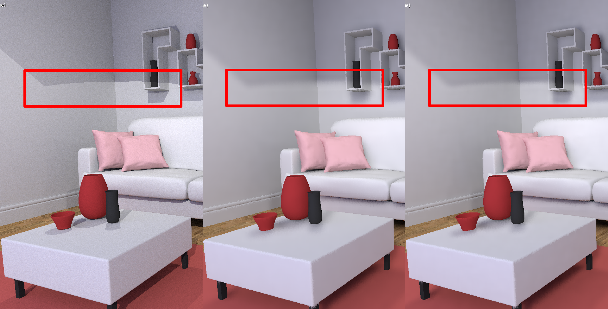

You can see the edge of shadow is sharper after the modification. When the post-process stage is turned off, it is also obvious that less block-wise artifact exist after the modification.

### Result Presentation

**Pink Room**

**Arcade**

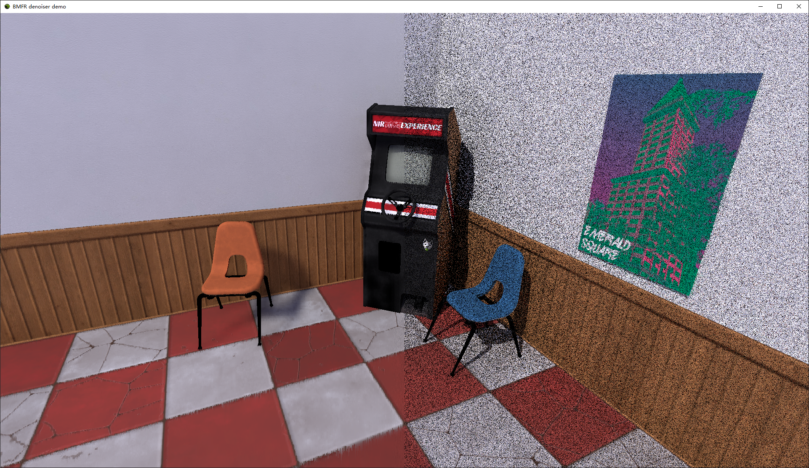

**Coffee shop** (http://developer.nvidia.com/orca/amazon-lumberyard-bistro)

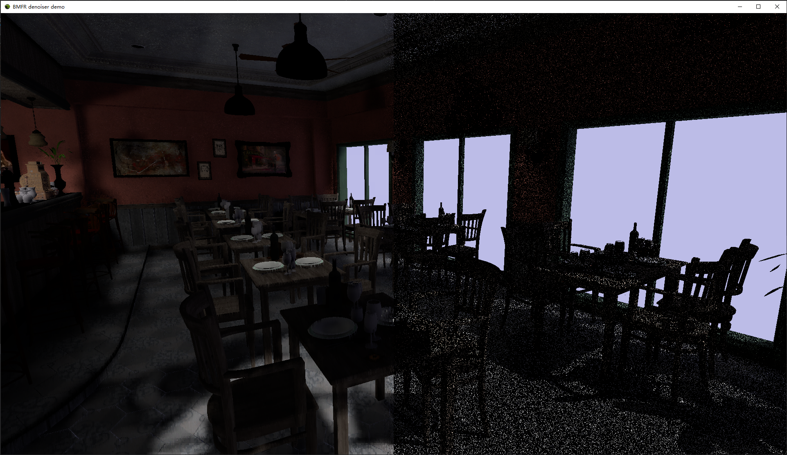

**Street**(http://developer.nvidia.com/orca/amazon-lumberyard-bistro)

**Temple** (https://developer.nvidia.com/ue4-sun-temple)

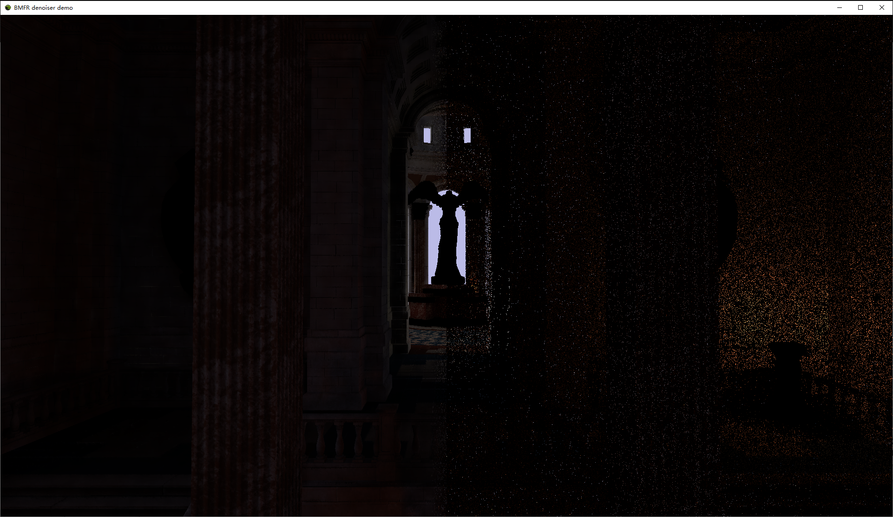

### Performance

Measured with Windows 10, i7-8750H @ 2.20GHz 16GB, RTX 2070 8GB (personal laptop)

With Falcor default scene

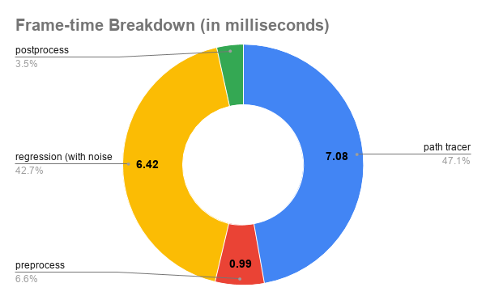

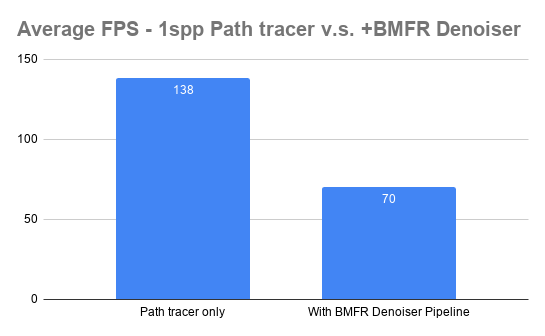

Although the regression stage takes the majority of time, we are still able to achieve real-time performance (70 fps) in the fairly complicated scenes.

------

Acknowledgments:
----------------------------------------------------------------------------------------------

- [Nvidia Falcor Library](https://developer.nvidia.com/falcor)
- [*A Gentle Introduction To DirectX Raytracing*](http://cwyman.org/code/dxrTutors/dxr_tutors.md.html)
- *[Blockwise Multi-order Feature Regression For Real-Time Path Tracing Reconstruction](http://www.tut.fi/vga/publications/Blockwise_Multi-Order_Feature_Regression_for_Real-Time_Path_Tracing_Reconstruction.html)* This is the paper our project is based on.
- The Coffee shop scene, street scene and temple scene are from the Falcor provided Scene archive: https://developer.nvidia.com/orca
- [imgui](https://github.com/ocornut/imgui) is used as the GUI generator.
- [Spatiotemporal Variance-Guided Filtering: Real-Time Reconstruction for Path-Traced Global Illumination](https://research.nvidia.com/publication/2017-07_Spatiotemporal-Variance-Guided-Filtering%3A)     helps us how to build a thorough denoise pipeline using Falcor library.