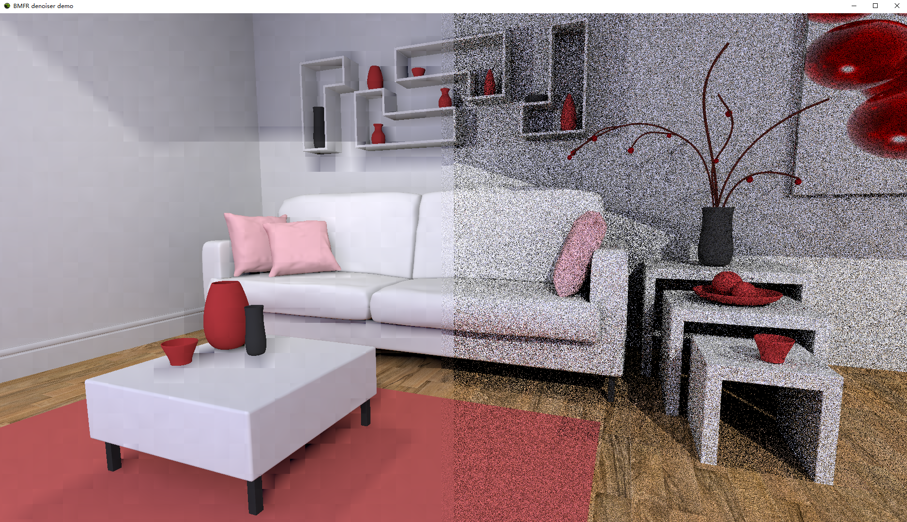

## Real-Time Path Tracing Reconstruction In DXR

### Team member:

- Jiangping Xu
  - [LinkedIn](https://www.linkedin.com/)
- Gangzheng Tong
  - [LinkedIn](https://www.linkedin.com/)
- Tianming Xu
  - [LinkedIn](www.linkedin.com/in/tianming-xu-8bb81816a)

### Project Goal

In the current game and file industry, **path tracing** is the best candidate for generating photorealistic and
physically correct pictures. However, the performance bottleneck has limited the usage of path tracing in
**real-time rendering** field. Given our interest in game industry, which concerns interactive/real-time
rendering, we want to explore the possibility of real-time path tracing using the denoising method
introduced recently in *SIGGRAPH Asia 2019: Blockwise Multi-Order Feature Regression* for **Real-Time**
**Path Tracing Reconstruction** . We also know that the current **Direct3D 12** and **DirectX Ray Tracing(DXR)** are the latest API to render picture using ray-tracing technique. Hence, we want to build up a thorough pipeline in D12 to not only generate 1spp noisy input picture, but also denoise the input picture with feature buffer through the D12 computing shaders, and then generate the high quality processed-picture, recording the performance of that.

### Overview:

This project is complete **DXR pipeline** that use 1 spp path tracing noisy image and *Blockwise Multi-Order Feature Regression* technique to produce high resolution physically-correct image. There are **five** stages in our pipeline:

1. A basic path tracer produces 1 spp output image and populates necessary feature buffers(normal and world position) based on the 1 spp image
2. Pre-process the current frame to mix up with previous frames’ data
3. Apply *Blockwise Multi-Order Feature Regression* on the feature buffers
4. Post-process the frames’ data by accumulating the current frame’s information in
5. Apply the computed color to the pixel

We will introduce each stage in detail with the result image in next section

### Pipeline

#### Path Tracer and Feature Buffers

Path Tracing is a computer graphics Monte Carlo method of rendering images of three-dimensional scenes such that the global illumination is faithful to reality. Generally speaking, a path tracer shoots multiple rays from each pixel, which would interact with all the objects within the scene and based on the materials of each object, shoot subordinate rays from the intersection points. If the ray hits an emission surface(light source), the surface of the object it intersects with will be illuminated. The process is very similar to the one our eye proceeds the physical world, but in the opposite direction.

In our implementation, path tracer is the first stage we need to handle. Our path tracer will not only produce the 1 sample per pixel(spp) rendered image, but also will populate three feature buffers: WorldPosition, WorldNormal and DiffuseColor(albedo) of the objects. All of these data will be used in later stage.

Here, we need to thank NVIDIA for their [Falcor](https://developer.nvidia.com/falcor) library. Falcor is an open-source real-time rendering framework designed specifically for rapid prototyping. Besides, there is a great tutorial to teach us How to use Falcor: [*A Gentle Introduction To DirectX Raytracing*](http://cwyman.org/code/dxrTutors/dxr_tutors.md.html). Without their helps, we need to do everything from scratch and might not have enough time to build up the pipeline accordingly.

#### Pre-process

The core part of pre-process stage is the **temporal accumulation** of the noisy 1 spp data, which reprojects the previous accumulated data to the new camera frame. While we do the temporal accumulation, we need to test whether a specific pixel in previous frame is still within our view in the current frame. If so, we will accumulate the previous pixel's color to its position in the current frame. Otherwise, we will discard the pixel's previous color and fall back to the current frame's result completely. We don't just average the result, instead, we put more weight on the current frame's result. The ratio of previous data and current frame result is 8 : 2, causing the result to be more depending on the current frame.

Here is a gif to show the live demo of turning on pre-process and not turn-on

.gif)

#### Regression(BMFR)

The Regression step is the main part of our denoise pipeline. The basic idea of BMFR is that we have the input image and several feature buffers populated in previous stage, which we can combine them as a big feature matrix. Since they have the same dimension, we can do that without any conflict. Then the problem can be formulated to a standard least-squares expression with the following formula.

Since the feature matrix we set up is very big and hard to compute. We use QR factorization to decrease its dimension appropriately. After that, we need to apply stochastic regularization to avoid rank-deficient problem and assure the linear independency. Finally, we calculate the result and substitute it back. 

Here is a gif to show the live demo of turning on regression(bmfr) and not turn on.

#### Post-Process

If you look at the regression gif above closely, you might see many **blocky artifacts** on it. Those artifacts are cause d by operating the BMFR algorithm on non-overlapping blocks. To reduce the blockiness of the rendered image, we basically do the same process in our pre-process: accumulate the current pixel data with previously stored one. But in the post-process stage, we weigh more on the previous data because it gives us a guide on the basic color of that pixel, while using the current frame more like a modification.

Here is a pair of images with and without post-process turning on.

​																		Without post-process

​																	     With post-process

You can clearly see the image with post-process doesn't have many blocky artifacts between the big red jar and black jar while the one without post-process has obvious blocky artifacts in that area.

Here is a gif to show the live demo of turning on regression(bmfr) and not turn on.

### Result Presentation

**Pink Room**

**Arcade**

**Coffee shop** (http://developer.nvidia.com/orca/amazon-lumberyard-bistro)

**Street**(http://developer.nvidia.com/orca/amazon-lumberyard-bistro)

**Temple** (https://developer.nvidia.com/ue4-sun-temple)

### How to Build and Run

1. Clone

2. Go into **Falcor** Folder 
3. run [update_dependencies.bat](https://github.com/gztong/BMFR-DXR-Denoiser/blob/master/Falcor/update_dependencies.bat)
4. Open BMFR_Denoiser_Pipeline.sln
5. Build + Start in Release Mode

----------------------------------------------------------------------------------------------
Acknowledgments:
----------------------------------------------------------------------------------------------

- [Nvidia Falcor Library](https://developer.nvidia.com/falcor)
- [*A Gentle Introduction To DirectX Raytracing*](http://cwyman.org/code/dxrTutors/dxr_tutors.md.html)
- *[Blockwise Multi-order Feature Regression For Real-Time Path Tracing Reconstruction](http://www.tut.fi/vga/publications/Blockwise_Multi-Order_Feature_Regression_for_Real-Time_Path_Tracing_Reconstruction.html)* This is the paper our project is based on.
- The Coffee shop scene, street scene and temple scene are from the Falcor provided Scene archive: https://developer.nvidia.com/orca
- [imgui](https://github.com/ocornut/imgui) is used as the GUI generator.
- [Spatiotemporal Variance-Guided Filtering: Real-Time Reconstruction for Path-Traced Global Illumination](https://research.nvidia.com/publication/2017-07_Spatiotemporal-Variance-Guided-Filtering%3A)     helps us how to build a thorough denoise pipeline using Falcor library.